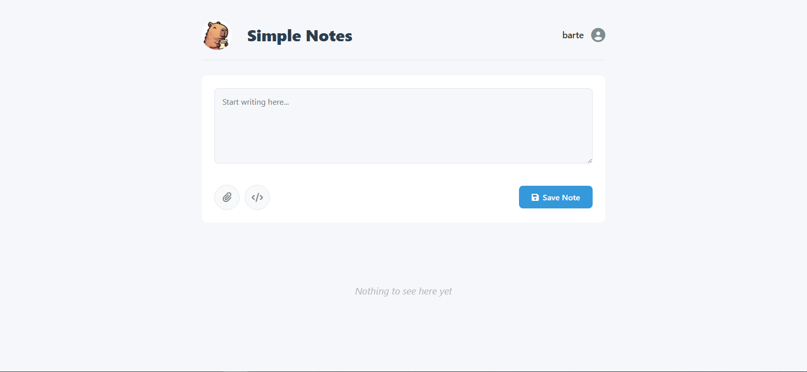

<div align="center">
  
  <h1>Simple Notes</h1>
</div>

<div align="center">
A simple, secure, and real-time note-taking web application. Built with Node.js, Simple Notes allows you to store your thoughts and files with encryption, all through a clean and modern web interface.
</div>
<br>
<table align="center">
  <tr align="center">
    <td align="center" valign="top">
      
    </td><td align="center" valign="top">
      
    </td><td align="center" valign="top">
      
    </td>
  </tr>
</table>

-----

## About The Project

Simple Notes was created to be a straightforward, self-hosted solution for taking notes securely. The main goal is to provide a minimalist user experience without sacrificing essential features like security and real-time collaboration. Your notes and files are encrypted, ensuring that you are the only one who can access your data.

* All updates happen in real-time thanks to WebSockets, meaning if you have the app open on two different devices, your changes will be reflected on both instantly.

* Whether you need to jot down a quick thought, write a detailed note with formatted text, or securely store a sensitive file, Simple Notes is the perfect tool for the job.

-----

## ✨ Features

  * 🔐 **Secure Storage**: All your notes and attachments are encrypted before being saved, ensuring your data remains private.
  * 🔃 **Real-time Updates**: Using WebSockets, your notes are updated across all sessions instantly. No need to refresh the page.
  * 💻 **Clean and Modern UI**: A beautiful and simple interface that gets out of your way.
  * 🎨 **Light & Dark Themes**: Switch between light and dark mode for your viewing comfort.
  * 📎 **File Attachments**: Securely attach any file to your notes.
  * ✍️ **Markdown Syntax Helper**: A quick guide for formatting your text with headers, bold, italics, strikethrough, checkboxes, lists, urls and code blocks.
  * 📝 **Full Note Management**: Easily create, edit, and delete your notes.
  * 🧾 **Login System**: Simple user authentication with preferences saved for each user.
  * 🎭 **User Profile**: Profile page for user managment and a dedicated panel for administrators to manage the application and its users.
  * 🚀 **Self-Hosted**: You have full control over your data on your own server.

-----

## 🛠️ How It Works

Simple Notes runs on a lightweight **Node.js** and **Express** backend.

  * **Notes** are stored in a local **SQLite** database.
  * **File attachments** are saved in a dedicated folder on the server's file system.

All content, whether in the database or in the attachments folder, is encrypted to ensure maximum privacy.

-----

## 🚀 Getting Started

You can get your own instance of Simple Notes up and running in minutes. Choose one of the two methods below.

### Using Docker (Recommended)

This is the simplest way to get started. All you need is Docker installed on your machine.

Run the following command in your terminal:

```
docker run -d -p 3000:3000 --name=simple-notes --restart unless-stopped bartche/simple-notes
```

### From Source

If you prefer to run the application from the source code, follow these steps:

1.  **Clone the repository:**

    ```
    git clone https://github.com/bartche/simple-notes.git
    ```

2.  **Navigate to the project directory:**

    ```
    cd simple-notes
    ```

3.  **Install the dependencies:**

    ```
    npm install
    ```

4.  **Start the server:**

    ```
    node server.js
    ```

-----

## USAGE

Once the application is running (either via Docker or from source), open your web browser and navigate to:

**http://localhost:3000**

-----

## 🔒 Running Behind a Reverse Proxy

If you plan to run Simple Notes behind a reverse proxy (like Nginx, Apache, etc.), it's crucial to configure it to allow WebSocket connections to pass through. This is essential for the real-time update feature.

As an exemple, for Nginx you must add the following directives to your server block configuration:

    # Required for WebSocket support
    proxy_http_version 1.1;
    proxy_set_header Upgrade $http_upgrade;
    proxy_set_header Connection "upgrade";
    
    # Optional but recommended headers
    proxy_set_header Host $host;
    proxy_cache_bypass $http_upgrade;

-----
    
## 🤖 DISCLAIMER

Please note: A significant portion of the code for this project was written by AI. It was guided, tested, and modified by a human developer, but AI played a central role in its creation.
